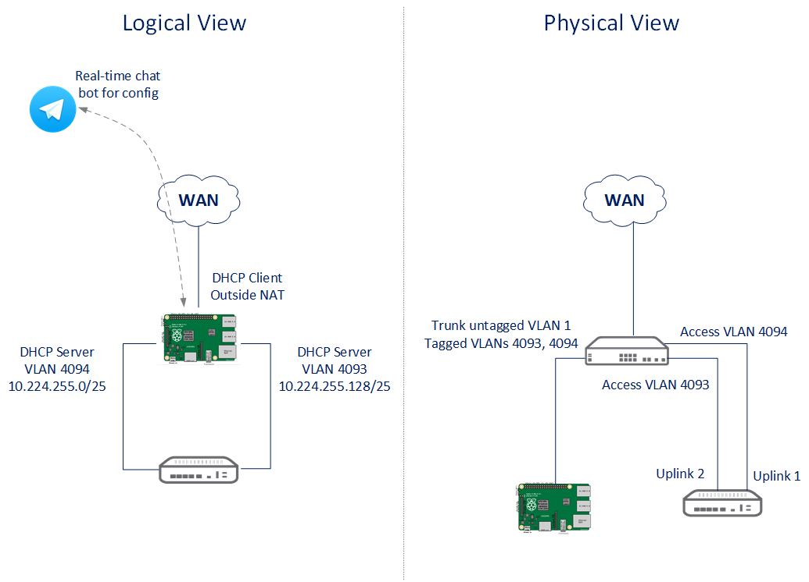

# piwem

Welcome to the house of the **bootstrap.sh** script to turn your Raspberry Pi into a small WAN emulator!

The goal of this project is to have the Raspberry Pi turned into a small one-arm router that can be used to emulate WAN impairments like variable delay, jitter and packet loss, for SD-WAN demos.

The raspberry sits between the actual CPE router and the SD-WAN gateway, providing two links (VLAN 4094 and VLAN 4093) that can be managed independently, as shown below:



## Prerequisites - Important!

This emulator is managed through *telegram*. To be able to issue orders to your emulator and get feedback, you will need to create a [telegram chat bot](https://core.telegram.org/bots).

Don't worry, you don't need to code. Just follow the instructions in the link above to name your bot and get your API key. Once you have your API key, keep reading.

## Quick Start

After you have created your [telegram chat bot](https://core.telegram.org/bots) (and got the API key for the bot), just download the script to your raspberry pi, and run it:

```
wget https://raw.githubusercontent.com/ArubaIberia/piwem/master/bootstrap.sh

chmod 0755 bootstrap.sh

sudo ./bootstrap.sh
```

The script should work best in a freshly installed [Raspbian](https://www.raspberrypi.org/downloads/raspbian), either the lite or desktop version.
It will download the required packages and ask for the API key during the process.

You are also given a few options during installation, such as creating a new admin user, or removing the built-in "pi" user. Do whatever suits you better, neither of that is mandatory. 

## Controlling your emulator

Your bot should be online few seconds after you reboot the Raspberry (provided the Raspberry gets internet connectivity). Search your bot by name in telegram and add it to your contact list. Then send any message (try sending the word "ip"), and wait for the bot to greet you!

The code of the bot is also [shared on github](https://github.com/ArubaIberia/ipbot). Please have a look there for a quick introduction to the commands the bot accepts.

